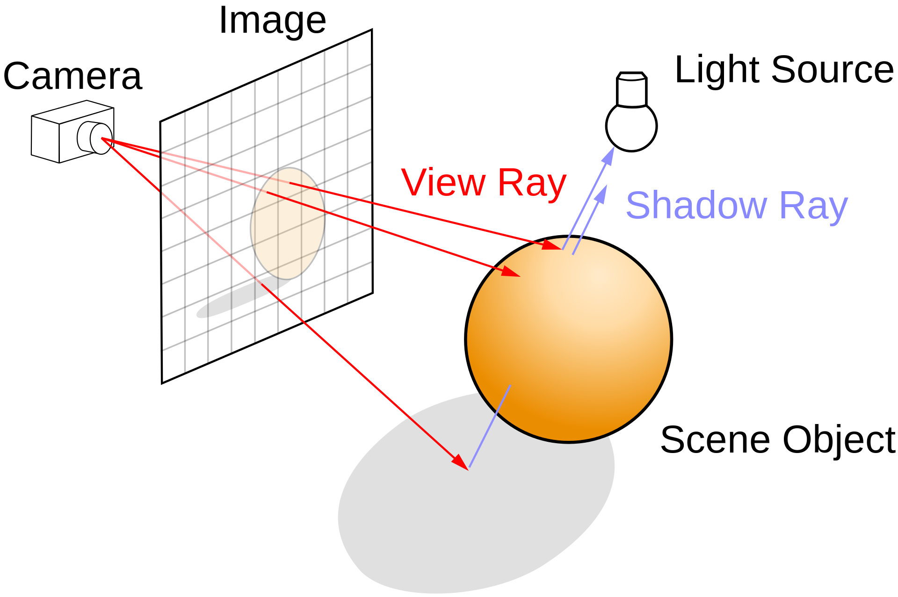

<div align="center">
  
</div>
<div align="center">
  
  
  
</div>

# MiniRT

This project is an implementation of a [Ray Tracer](https://en.wikipedia.org/wiki/Ray_tracing) using the path tracing algorithm.

## Brief

A ray tracer is a program that takes a scene and a camera and renders the scene to a screen. The properties of a ray tracer are:

- The camera has position and a direction
- The camera can be rotated, zoomed in and out, and moved around the scene
- The objects in the scene have a color, shape, material and position
- There is light in the scene
- The light emits rays that intersect with objects in the scene

## Requirements for development

These are the dependencies required for development:

### Create a venv

```python3
python3 -m venv venv
source venv/bin/activate
pip install -U pip
```

### Install norminette

```python3
pip install -U norminette
```

### Install pre-commit hooks

```python3
pip install pre-commit
pre-commit install --install-hooks --overwrite
```

## Docs

### How the Ray Tracer algorithm works

1. Cast a ray into the scene, and find where it strikes a surface.
2. Cast a ray from that point toward each light source to determine which
lights illuminate that point.
3. If the surface is reflective, cast a new ray in the direction of reflection and
recursively determine what color is reflected there.
4. If the surface is transparent, do the same thing in the direction of refrac-
tion.
5. Combine all colors that contribute to the point (the color of the surface,
the reflection, and refraction) and return that as the color of the pixel.

## References

- [The Ray Tracer Challenge](https://www.raytracing.org/raytracerchallenge/)
- [How Ray Tracing Works](https://www.youtube.com/watch?v=lKIytgt3KXM)
- [Ray Tracing in One Weekend](https://raytracing.github.io/books/RayTracingInOneWeekend.html)
